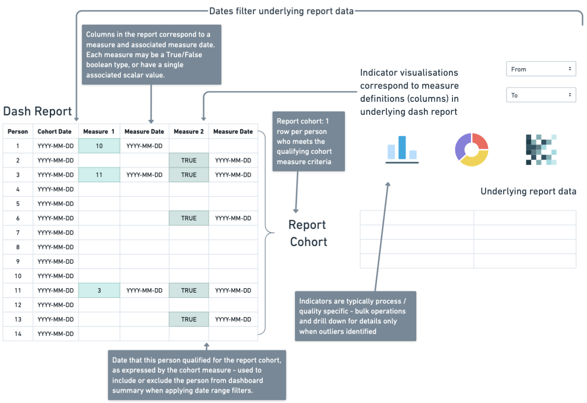
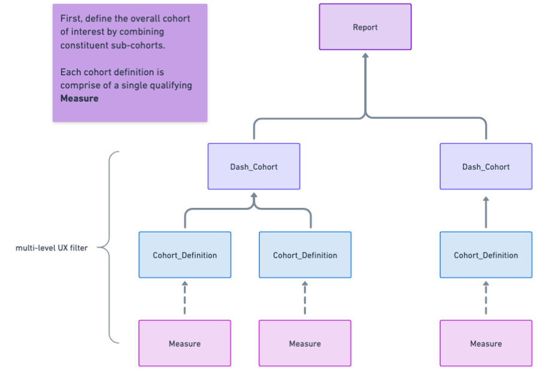
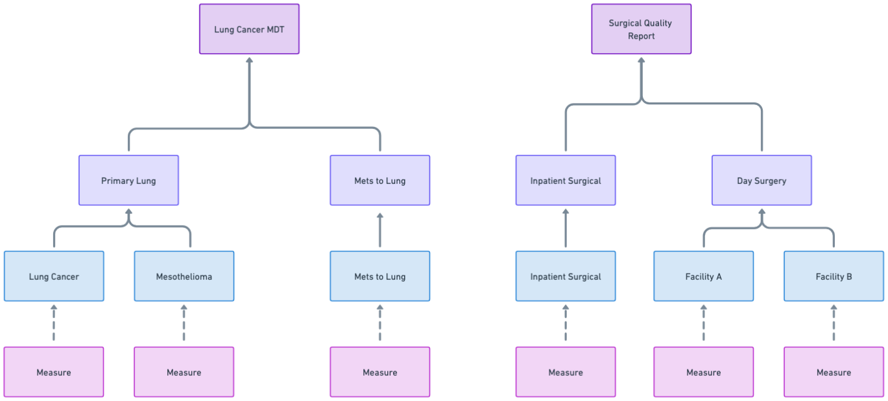

# Reporting and Measure Execution Model

The `oa-cohorts` library defines the core domain model for constructing, executing, and evaluating clinical quality reports.

It compiles configurable logical criteria into SQL, executes them, and materialises qualification events that are propagated upward into indicators and reports.

Every logical construct resolves to a set of time-stamped qualification events, represented by the [`MeasureMember`](measure_resolution.md) object.

-----------------

## Conceptual Layers

### Layer 6: Reporting

A `Report` is the top-level orchestration unit combining cohorts and indicators - responsible for coordinated measure execution. 
It is defined as a combination of cohorts (_what logical unit of patients are in-scope for this specific set of reporting analyses?_) and 
indicators (_whether a defined subset of patients met specific clinical criteria within a defined population and time context._)

The object handles aggregation of cohorts and indicators, as well as coordinating measure execution.

Because cohorts, indicators and measures are all reusable in multiple report settings, it is simpler for them to operate entirely independently of 
the report object, and therefore the `Report` also handles the special case `measure_id = 0`, which simply surfaces all members of the full cohort.

Reports do not generate SQL directly. They orchestrate execution and consume `MeasureMember` results.



The figure illustrates the intended operational model of the reporting engine. Measures resolve into person-level, time-stamped qualification events that are materialised as columns in an underlying report dataset. Indicators and dashboard visualisations are derived directly from these measure definitions, while report-level date filters operate on qualification dates to dynamically include or exclude individuals. This dataset can then be surfaced via external visualisation tools (e.g., Power BI) or exposed through an API to power a RESTful dashboard application.

### Layer 5: Dash Cohort 



A `DashCohort`idefines a clinically meaningful population by grouping one or more cohort definitions, each of which wraps a single measure.

A cohort’s members are the union of its underlying definitions. 
In downstream reporting systems, those definitions can be surfaced as sub-cohorts for filtering, stratification, or drill-down analysis, but their core purpose is to provide a stable population boundary around which reporting logic operates.



For example, a Lung Cancer MDT report may draw from separate primary lung and metastatic lung cohorts. A surgical quality report may distinguish between inpatient and day surgery populations while evaluating the same underlying operative measures. In both cases, the clinical criteria remain constant; what changes is the reporting context.

### Layer 4: Indicators

Composes measures into denominators (_for whom is this indicator relevant?_) and numerators (_out of those individuals for whom the indicator is relevant, who met the criteria?_).

This structure mirrors the way clinical quality is reported in practice: first identify the relevant patients, then evaluate performance within that group.


At execution time, both numerator and denominator measures must be executable. Each resolves independently into a set of `MeasureMember` objects, preserving episode alignment and qualification dates. The indicator then derives its membership by intersecting numerator and denominator members, ensuring that only individuals eligible under the denominator contribute to performance calculations.

Numerator and denominator each retain their own qualification dates. These dates are not collapsed or overwritten. This allows reporting logic to apply temporal comparators at the report layer, rather than embedding window constraints directly into measure definitions.

Indicators often depend on temporal relationships between events.

For example:

* Treatment within 30 days of death
* Smoking status documented within 30 days of cohort entry
* Post-operative mortality within 90 days

In these cases, numerator and denominator measures may each resolve at different dates. The reporting layer applies temporal comparators between these preserved qualification dates.


This design ensures that:

* Clinical logic remains modular
* Time windowing remains configurable at the report level
* Indicators can be reused in different reporting contexts

### Layer 3: Measure

Recursive tree of subqueries and/or child measures. 

Compiles to arbitrary-depth boolean query logic, which when executed produces a set of `MeasureMember` rows.


A `Measure` can be:

* Leaf: (wraps a single subquery) 
* Composite (combination of child measures)

Measures do not execute SQL directly — they compile into SQL via `MeasureSQLCompiler`, and execution is handled by `MeasureExecutor`.


### Layer 2: Subquery

A `Subquery` is the atomic SQL-producing unit.

* Combines rule-level selects with `UNION ALL`
* Driven by one or more `QueryRule` objects. 
* Acts on a specific `RuleTarget` (e.g., diagnosis, treatment, observation).
* For each rule, emits a row that will return results of the canonical `MeasureMember` shape 

```
{person_id: i, episode_id: e, measure_resolver: x, measure_date: yyyy-mm-dd}
```

All subqueries must return these four columns:

| Column            | Meaning                                                 |
|-------------------|---------------------------------------------------------|
| `person_id`       | Individual identifier                                   |
| `episode_id`      | Clinical episode (if applicable)                        |
| `measure_resolver`| Logical grouping key (often episode or event id)        |
| `measure_date`    | Date at which the criterion was satisfied               |

This shape is enforced so that higher-level logic can safely combine results.

!!! note "Rule Combinations Inside Subqueries"

    If multiple rules exist within a subquery:

    - Each rule produces its own `SELECT`
    - These are combined with `UNION ALL`

    This preserves all qualifying events.

    Subqueries do not combine with other subqueries — that is the role of `Measure`.


### Layer 1: QueryRule

A `QueryRule` represents an atomic predicate on a measurable field.

Examples:

* Diagnosis concept equals X
* Numeric value greater than Y
* String value matches pattern Z

A rule does not produce SQL on its own — it contributes a `WHERE` clause within a Subquery.


## Feeding results to higher-level reporting systems and visualisers

The system is designed so that:

* Every logical construct preserves qualification dates.
* AND logic synthesises correct qualification moments.
* OR logic preserves all candidate dates.
* Resolver alignment prevents false intersections.

At the reporting layer, this enables:

* Filtering members by qualification date
* Computing time windows
* Evaluating temporal indicators
* Comparing numerator vs denominator timing
