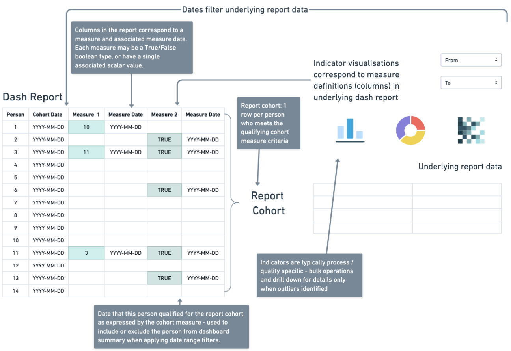
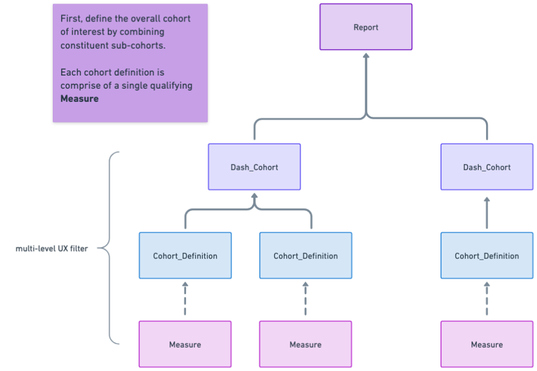
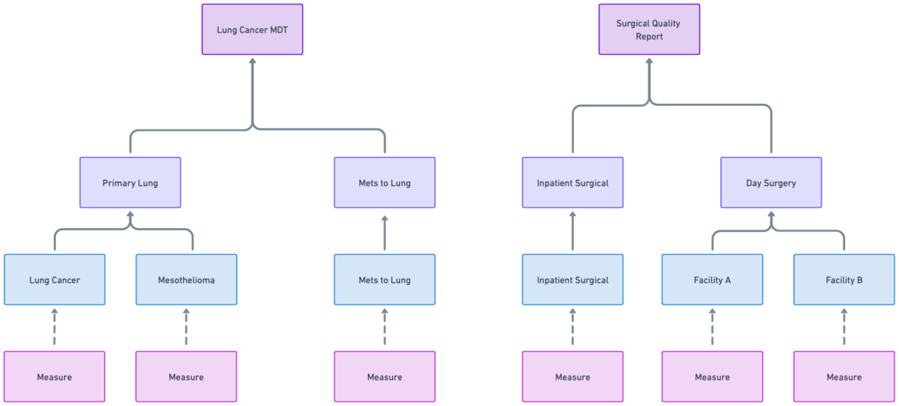
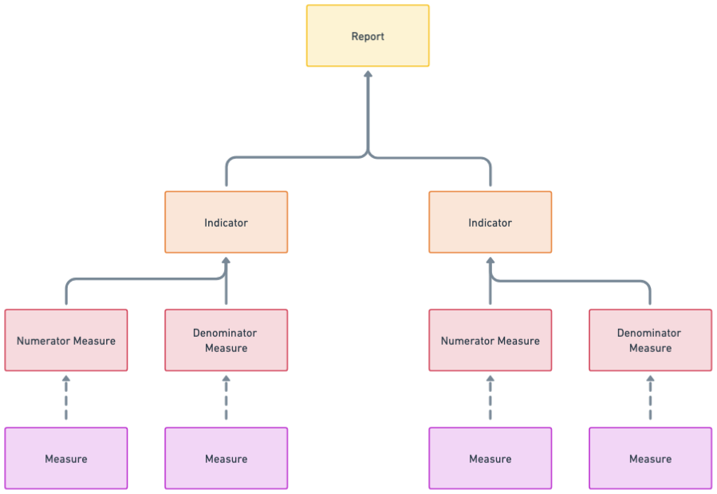
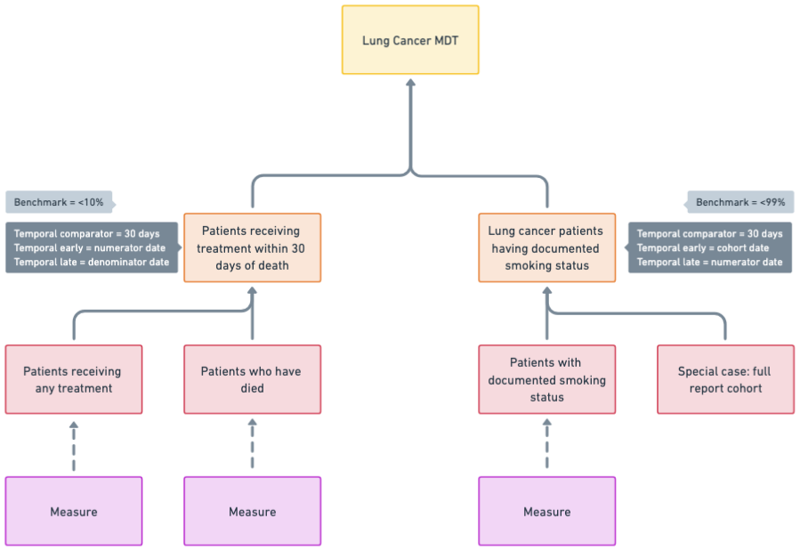
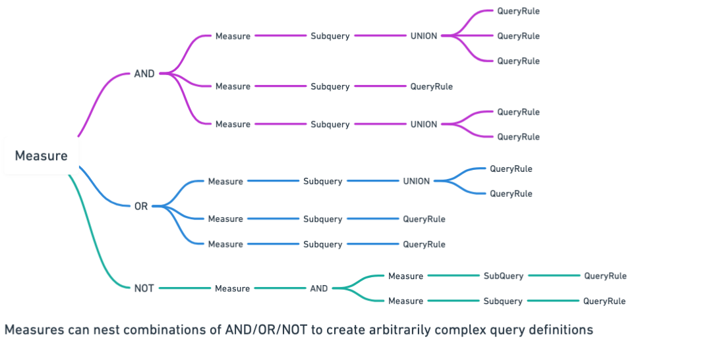

# Reporting and Measure Execution Model

`oa-cohorts` defines the core domain model for building reusable cohort logic, compiling it to SQL, and materialising time-stamped qualification events for downstream reporting.

Every executable unit ultimately resolves to a set of [`MeasureMember`](measure_resolution.md) rows:

```text
{person_id, episode_id, measure_resolver, measure_date}
```

That canonical shape lets reports, indicators, and dashboards reuse the same underlying logic while preserving timing and episode alignment.

---

## Conceptual Layers

### Layer 6: Report

A `Report` orchestrates cohort and indicator execution for a specific reporting context.

Reports:

* group together one or more dashboard cohorts
* execute cohort and indicator measures in a coordinated way
* treat `measure_id = 0` as the special "full report cohort" denominator
* assemble final output rows with preserved numerator and denominator dates

Reports do not compile measure SQL themselves. They consume `MeasureMember` results produced lower in the stack.



### Layer 5: Dash Cohort



A `DashCohort` defines a clinically meaningful population by grouping one or more cohort definitions, each of which wraps a single measure.

A cohort's members are the union of its underlying definitions. In downstream reporting systems those definitions can be surfaced as sub-cohorts for filtering or drill-down, but their primary role is to create a stable population boundary for indicator logic.



### Layer 4: Indicator

Indicators compose measures into:

* denominator: who is in scope
* numerator: which in-scope members met the target condition



Both numerator and denominator resolve independently to `MeasureMember` rows. Final report payloads keep both dates:

* `denominator_date`
* `numerator_date`

Indicator-level relative date windows are applied during payload assembly, not embedded in reusable measure definitions. This keeps measures broad and reusable while allowing different reports to impose different timing rules.



### Layer 3: Measure

A `Measure` is a recursive logical node that compiles to SQL and produces `MeasureMember` rows.

Measures can be:

* leaf measures backed by a single subquery
* composite measures backed by child measures

The current dashboard configuration uses `OR` and `AND` combinations. The `RuleCombination` enum also includes `EXCEPT`, but it is not used by the shipped config and is therefore not the focus of the usage docs here.

Measures are compiled by `MeasureSQLCompiler` and executed by `MeasureExecutor`.



### Layer 2: Subquery

A `Subquery` is the atomic SQL-producing unit.

It defines:

* a `RuleTarget`
* a `RuleTemporality`
* one or more `QueryRule` objects

Subqueries are responsible for:

* resolving the measurable class for their target
* choosing the field that each rule should inspect
* generating `ANY`, `FIRST`, and `UNDATED` SQL variants

All subqueries emit the canonical measure-member columns:

| Column | Meaning |
|---|---|
| `person_id` | individual identifier |
| `episode_id` | clinical episode |
| `measure_resolver` | logical alignment key, usually the episode id |
| `measure_date` | date on which the criterion was satisfied |

Rule handling inside a subquery:

* each rule contributes its own `WHERE` clause fragment
* rule-level selects are combined with `UNION ALL`
* `FIRST` collapses those candidate rows to the earliest qualifying date per resolver

Value-column resolution depends on the rule types present:

* exact, hierarchy, presence, and absence rules use a concept-like field
* substring rules use the measurable's string field
* predicate rules use the measurable's predicate field
* scalar rules always use the measurable's numeric field for threshold comparison
* scalar rules only require a concept field when at least one scalar rule has `concept_id != 0`

That last point is important for derived window measurables such as `tx_to_death_window` and `referral_to_specialist_window`: threshold-only scalar rules can run against numeric-only measurables.

### Layer 1: QueryRule

A `QueryRule` is the smallest declarative unit in the engine: a single predicate applied to a field resolved by a subquery.

Examples:

* diagnosis concept equals X
* numeric value is less than Y
* predicate column is true
* concept code contains substring Z

A rule does not generate a standalone query. It only contributes a `WHERE` clause fragment within a subquery.

---

## Why MeasureMember Rows Matter

The engine preserves qualification rows instead of reducing everything to a single boolean membership flag.

That supports:

* trend analysis over time
* indicator windows anchored to cohort membership dates
* episode-aware joins for `AND` logic
* multiple qualifying events per person when `OR` logic applies

This is the core design choice that makes the reporting layer flexible without forcing each report to redefine its own SQL.
