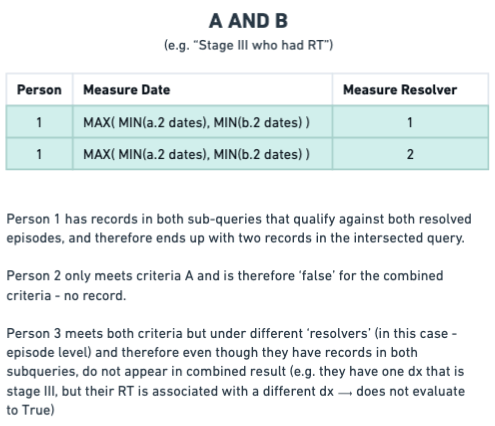

# Measure Resolution 

## MeasureMember - atomic unit of result

When a measure is executed, it produces a sequence of:

```Python
@dataclass(frozen=True)
class MeasureMember:
    person_id: int
    measure_resolver: int
    episode_id: Optional[int]
    measure_date: Optional[date]
```

A `MeasureMember` represents a specific person qualifying for a measure at a specific time, for a specific resolver.

It is not only the fact of membership, because it includes resolution to a time-stamped qualification event. 
This distinction is critical for reporting, which requires flexible time-windowing periods to produce trends and per-period analysis.

## Measure Combination Semantics

Measures use `RuleCombination` to compose child measures via `OR` or `AND`, and the handling of these semantics is significantly different when composing from lower levels.


### OR Logic: Union of qualifying events


`OR` logic preserves all qualifying rows.

Implementation:

* Each child measure emits rows
* Rows are combined using `UNION ALL`
* Multiple qualification dates are preserved.
* No resolver alignment is required.
* Events bubble upward unchanged.

Example:

* Measure = ECOG 0 OR ECOG 1

If a person has:

* ECOG 0 on Jan 1
* ECOG 1 on Mar 1

Result: Two `MeasureMember` rows, with both dates preserved

### AND Logic: Resolver-Aligned Intersection



`AND` logic is not simply “person appears in both”. It requires that the same resolver must satisfy all child criteria.

Implementation:

* Each child measure emits canonical rows.
* Children are joined on measure_resolver.
* Resolver alignment is required.
* Qualification date shifts forward to the last satisfied condition.
* If resolvers differ, the row is excluded.
* Qualification date becomes: `greatest(child_1_date, child_2_date, ...)`

This represents the earliest moment at which all criteria are true.

Example:

* Measure = Stage III AND Radiotherapy

If a person has:

* Stage III on Jan 1 (episode 10)
* Radiotherapy on Feb 15 (episode 10)

Result: One row, qualification date = Feb 15

If RT occurred under episode 20 instead, there is no result (resolvers do not align)

### Nested Measures

Measures can be nested arbitrarily:

```
A AND (B OR C)
```

Evaluation proceeds bottom-up:

1. B OR C → union of events
2. A → events
3. AND joins A with (B OR C) on resolver
4. Qualification date = greatest of aligned dates

The canonical shape is preserved at every level.