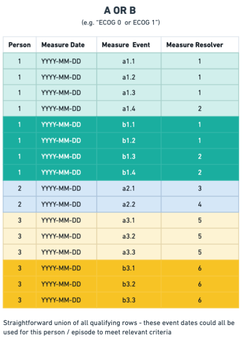
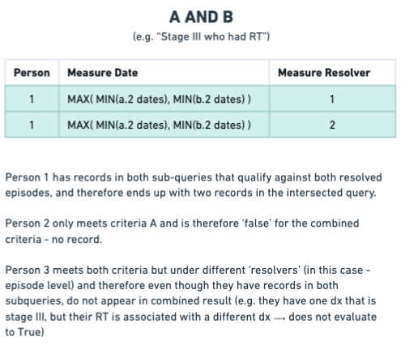
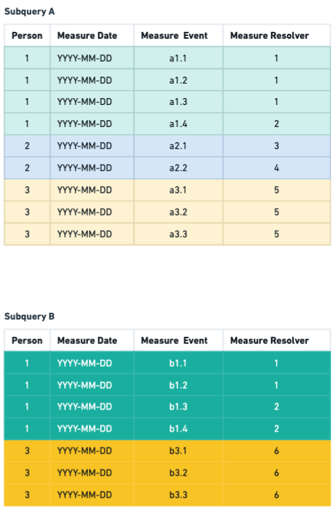

# Measure Resolution

## `MeasureMember`: the atomic result row

When a measure executes, it materialises `MeasureMember` rows:

```python
@dataclass(frozen=True)
class MeasureMember:
    person_id: int
    measure_resolver: int
    episode_id: Optional[int]
    measure_date: Optional[date]
```

A `MeasureMember` is not just a boolean membership flag. It captures:

* who qualified
* under which resolver
* on what date

This preserved timing is what allows indicator windows, per-period reporting, and episode-aware logic to work later in the pipeline.

## Canonical Combination Semantics

Measures compose child results using the canonical member shape. In the shipped config this is primarily through `OR` and `AND`.

### `OR`: preserve all qualifying rows

`OR` logic unions child outputs without collapsing them.

Implementation shape:

* each child emits canonical rows
* rows are combined with `UNION ALL`
* all qualifying dates are preserved

Example:

* measure = ECOG 0 OR ECOG 1

If the same person qualifies on two different dates, both rows survive.



### `AND`: resolver-aligned intersection

`AND` is not a simple person-level intersection. The same `measure_resolver` must satisfy all child criteria.

Implementation shape:

* child rows are aligned by `measure_resolver`
* the resulting qualification date is the latest child date
* rows with mismatched resolvers do not qualify together

This represents the earliest point at which all required conditions have become true for the same clinical context.

Example:

* measure = Stage III AND Radiotherapy

If Stage III qualifies under episode 10 and Radiotherapy qualifies under episode 10, the composite measure qualifies.

If the two child rows belong to different episodes, they do not intersect.



### `FIRST` vs `ANY`

The engine compiles multiple SQL variants for measures and subqueries:

* `ANY`: preserve all qualifying rows
* `FIRST`: collapse to the earliest qualifying row per resolver
* `UNDATED`: keep qualifying membership without dates for intermediate set logic

For composite measures:

* `OR` uses `ANY`-style union semantics
* `AND` resolves through the `FIRST` path so that aligned child dates can be collapsed correctly

### `EXCEPT`

`RuleCombination.rule_except` exists in the enum and SQL combiner map, but it is not used by the shipped dashboard configuration and is not covered in depth by the current user-facing docs.

## Nested Measures

Measures can be nested arbitrarily:

```text
A AND (B OR C)
```

Evaluation proceeds bottom-up:

1. `B OR C` resolves to all qualifying child rows
2. `A` resolves independently
3. `AND` aligns rows on `measure_resolver`
4. the composite qualification date becomes the latest aligned child date

The canonical member shape is preserved at every level, which is why deeply nested logic can still feed report generation consistently.


